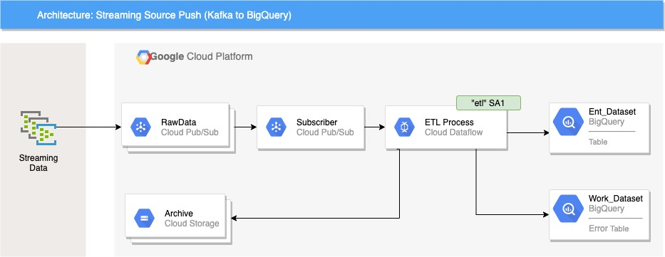
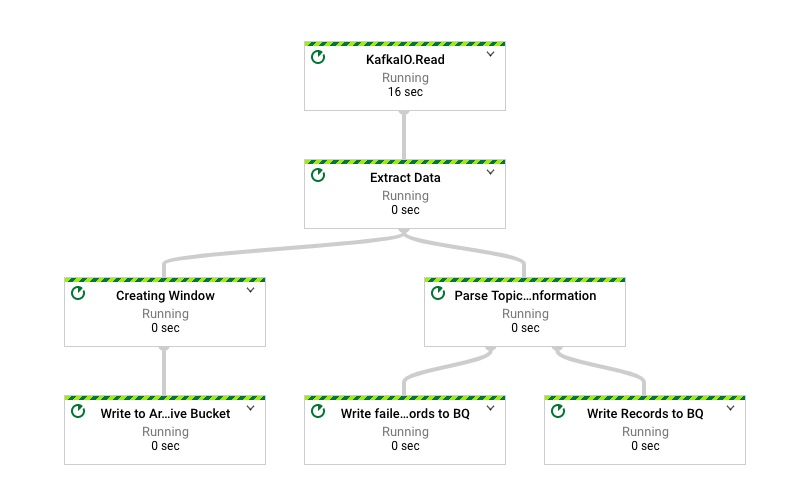

## Apache Beam Example to read from Kafka Topic and write to BigQuery

This is a sample program to read from Kafka and store the data in BigQuery. It's written in [Apache Beam](https://beam.apache.org/).  



Figure shows the Kafka to BigQuery pattern. The arrows show the data flow. The ETL process reads the Streaming Data from On-Prem (in this case Kafka) and writes the data to BigQuery. If there is any error while running the transformation it writes the bad records in a Error table.
The data from Kafka is written as it is in an archive bucket. Perform the following steps to run the Beam in Google Cloud Project.

#### 1. Make sure related services are enabled

```
gcloud services enable dataflow.googleapis.com
gcloud services enable bigquery.googleapis.com
```

#### 2. Create a topic in Kafka if not already exists

 `kafka-topics.sh --create --zookeeper localhost:2181 --replication-factor 1 --partitions 1 --topic transcation_creditcard`

#### 3. Create a dataset

`bq mk --dataset transactions`

You can also create directly from Console or have additional parameters(e.g., location) in command line [More Details](https://cloud.google.com/bigquery/docs/datasets#bq)

#### 4. Create a bucket from staging (e.g., `dev_beam_staging_0920`) and bucket for archive Data (e.g., `dev_transaction_archive_0999`)

```
export PROJECT_ID=<<GCP Project Id>
gsutil mkdir dev_${PROJECT_ID}_staging_0920
gsutil mkdir dev_${PROJECT_ID}_transaction_archive_0999
```
Buckets are global resources If the name is already taken, change the suffix (a randomly generated 4 digit number).

#### 5. Create Service Account (e.g., etl-sa)

Create a service account in the Google cloud project where you plan to run the Beam code and give it the permission to run as Dataflow worker. The service account should also have permission to write to BigQuery table in the `transactions` datasets and in the `archive` bucket. 

#### 6. Download the example data

The schema is based on mocked credit cards transactions related mock data from [here](http://storage.googleapis.com/dataflow-dlp-solution-sample-data/sample_data_scripts.tar.gz).
Download it, we will use this data to test the program. 

#### 7. Compile and package the program

`mvn clean install`

#### 8. Run the program
  
```
export BOOTSTRAP_SERVERS=localhost:9092

java -cp target/kafka2bq-0.1.jar com.bu.Kafka2BQ --tableName=credit_card  --dataset=transaction \
    --runner=DataflowRunner --tempLocation=gs://dev_${PROJECT_ID}_staging_0920/temp/ \
    --stagingLocation=gs://dev_${PROJECT_ID}_staging_0920/staging/ --project=$PROJECT_ID \
    --kafakBootstrapServer=$BOOTSTRAP_SERVERS  --topicName=transcation_creditcard \
    --archiveBucket=gs://dev_transaction_cc_archive  \
    --serviceAccount=etl-sa@$PROJEC_ID..iam.gserviceaccount.com
    --archiveFilenamePrefix=credit_card_transcation
 
```

#### 9. Send message to Kafka Topic

```/opt/kafka/bin/kafka-console-producer.sh --broker-list localhost:9092 --ation_creditcard < solution-test/CCRecords_1564602829.csv```


The Job Graph of the beam program is shown below 


As shown in the above block diagram. There is one source (Kafka topic) and multiple sinks ( BQ table with good records, BQ  table with errored data and archive bucket)
